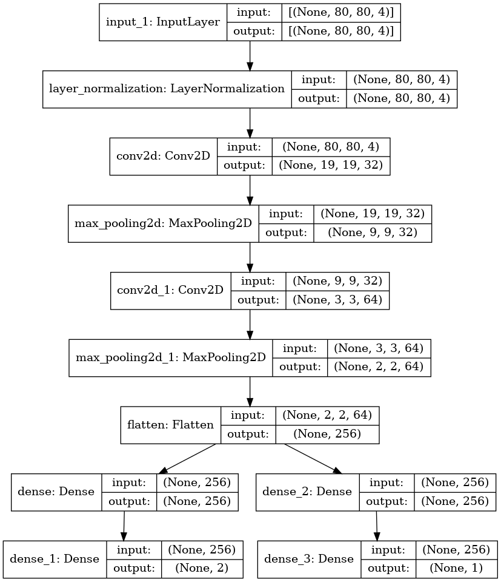
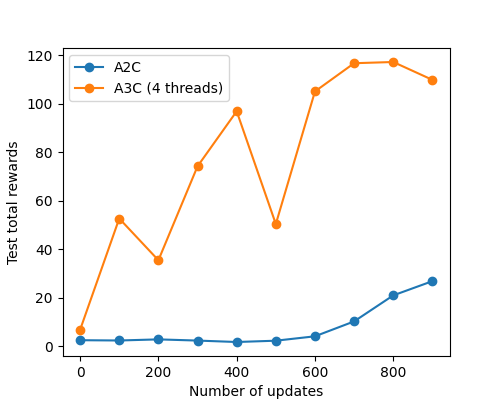

# A3C-Test

### Updates
#### *Mar 27, 2022*
- A3C now works well on **Flappy Bird**.
- The wrong sign in the loss of A3C is fixed. Now **CartPole** is much faster and more stable.

#### *Mar 25, 2021*

- A3C bugs are fixed! Now we are using `mp.Pipe` to send gradients to the global net.

- `GlobalNetwork.receive_grad()` is for gradient receiving and parameter updating.

- Plot the test accuracy after training by setting `LocalAgent(plot=Ture)`.


## Prerequisites 
- Python 3
- Tensorflow 2.0+ `pip3 install tensorflow`
- OpenAI gym `pip3 install gym`

## Usage
Please run `python3 A3C_Cartpole_new.py`

## Network Structure
The network structure for **CartPole** is shown as follows.


The network structure for **Flappy Bird** is shown as follows.


## A2C and A3C

For **A2C**, please just run one `mp.Process()`
```
if __name__ == '__main__':
    # Create global network
    global_net = GlobalNetwork(ob_shape=4, action_shape=2)
    ini_weights = global_net.get_weights()

    # multiprocessing
    lock = mp.Lock()
    center_end, local_end = mp.Pipe()
    p1 = mp.Process(target=local_run, args=(1, 100, True))
    
    p1.start()

    global_net.receive_grad(1)

```

For **A3C**, please use the following `main()`

```
if __name__ == '__main__':
    # Create global network
    global_net = GlobalNetwork(ob_shape=4, action_shape=2)
    ini_weights = global_net.get_weights()

    # multiprocessing
    lock = mp.Lock()
    center_end, local_end = mp.Pipe()
    p1 = mp.Process(target=local_run, args=(1, 100, True))
    p2 = mp.Process(target=local_run, args=(2, 200))
    p3 = mp.Process(target=local_run, args=(3, 300))
    p4 = mp.Process(target=local_run, args=(4, 400))

    p1.start()
    p2.start()
    p3.start()
    p4.start()

    global_net.receive_grad(4)

```
Here, we are using four threads. You can add more threads if you want.

# Evaluation
More local agents accelerate the training a lot!

