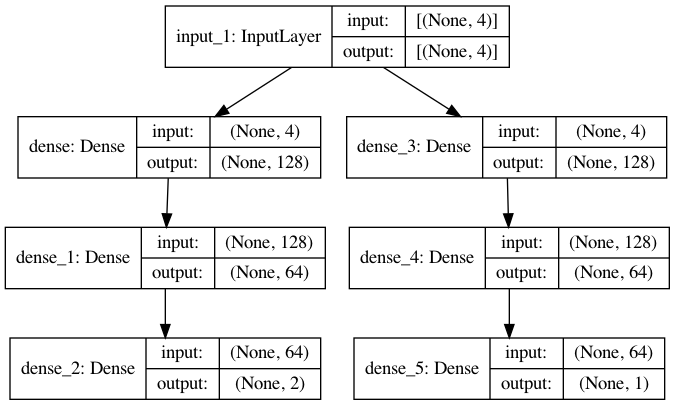

# A3C-Test

## Prerequisites 
- Python 3
- Tensorflow 2.0+ `pip3 install tensorflow`
- OpenAI gym `pip3 install gym`

## Usage
Please run `python3 A3C_Cartpole_new.py`

## Network Structure
The network structure is shown as follows.


## A2C and A3C

For **A2C**, please use the following `main()`
```
if __name__ == '__main__':
    # Create global network
    global_net = GlobalNetwork(ob_shape=4, action_shape=2)
    ini_weights = global_net.get_weights()

    local_agent = LocalAgent(ob_shape=4,
                             action_shape=2,
                             ini_weight=ini_weights,
                             seed=1,
                             index=1,
                             global_net=global_net,
                             lock=mp.Lock())
    local_agent.train()

```

For **A3C**, please use the following `main()`

```
if __name__ == '__main__':
    # Create global network
    global_net = GlobalNetwork(ob_shape=4, action_shape=2)
    ini_weights = global_net.get_weights()

    # multiprocessing
    # mp.set_start_method('spawn')
    lock = mp.Lock()
    p1 = mp.Process(target=local_run, args=(global_net, 1, 100, lock))
    p2 = mp.Process(target=local_run, args=(global_net, 2, 200, lock))
    p3 = mp.Process(target=local_run, args=(global_net, 3, 300, lock))
    p4 = mp.Process(target=local_run, args=(global_net, 4, 400, lock))
    
    p1.start()
    p2.start()
    p3.start()
    p4.start()
    
    while 1:
        a = 1  # Keep the main thread alive

```
Here, we are using four threads. You can add more threads if you want.
